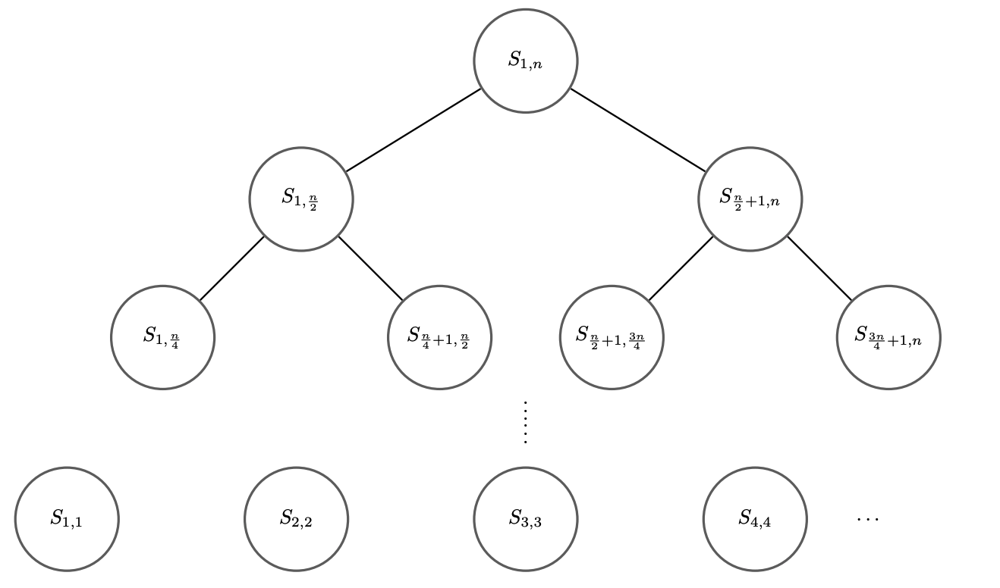
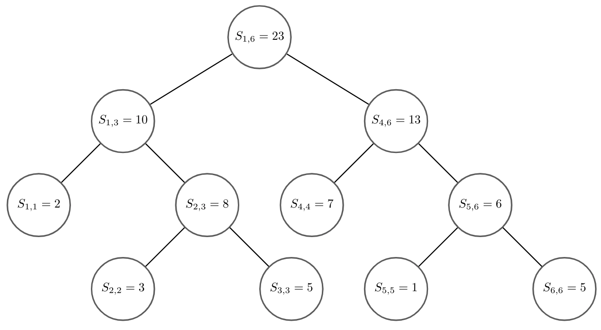
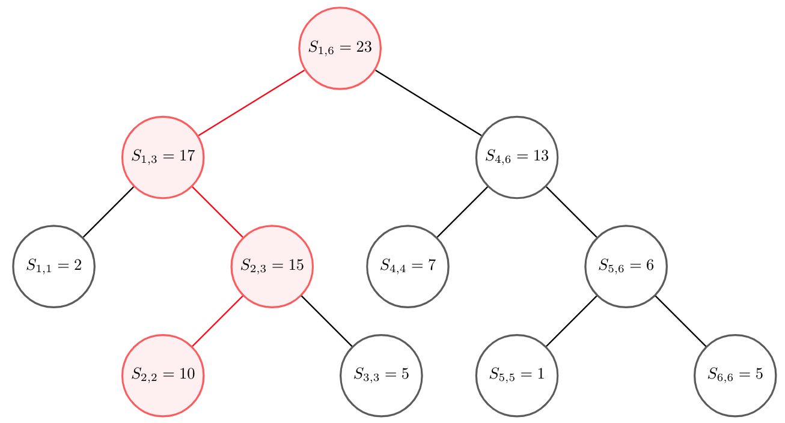
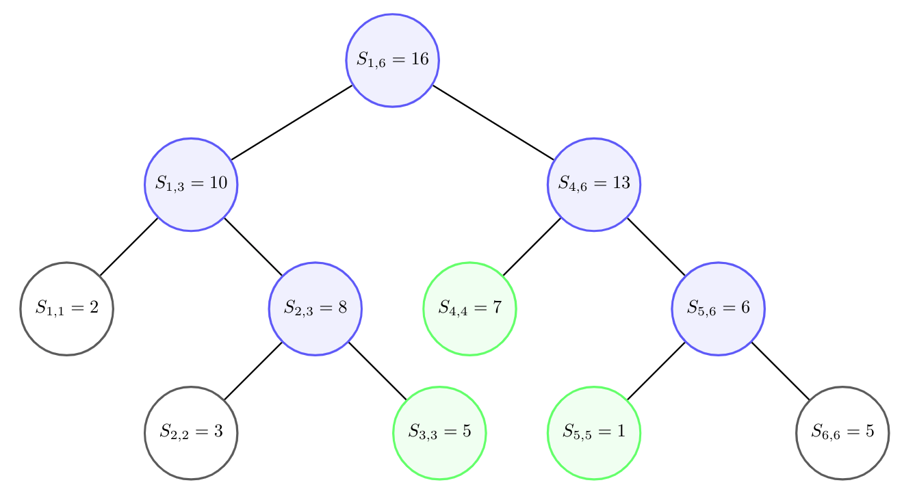

[//]: # (Below are links to math symbols)

[//]: # (Numbers)
[0]: https://latex.codecogs.com/gif.latex?0
[1]: https://latex.codecogs.com/gif.latex?1
[2]: https://latex.codecogs.com/gif.latex?2
[3]: https://latex.codecogs.com/gif.latex?3
[4]: https://latex.codecogs.com/gif.latex?4
[5]: https://latex.codecogs.com/gif.latex?5
[6]: https://latex.codecogs.com/gif.latex?6
[7]: https://latex.codecogs.com/gif.latex?7
[8]: https://latex.codecogs.com/gif.latex?8
[9]: https://latex.codecogs.com/gif.latex?9

[//]: #(BigO)
[o1]: https://latex.codecogs.com/gif.latex?O%281%29
[on]: https://latex.codecogs.com/gif.latex?O%28n%29
[olog]: https://latex.codecogs.com/gif.latex?O%28%5Clog%20n%29
[onlog]: https://latex.codecogs.com/gif.latex?O%28n%5Clog%20n%29
[on2]: https://latex.codecogs.com/gif.latex?O%28n%5E2%29
[on3]: https://latex.codecogs.com/gif.latex?O%28n%5E3%29

[n]: https://latex.codecogs.com/gif.latex?n
[x]: https://latex.codecogs.com/gif.latex?x
[arr]: https://latex.codecogs.com/gif.latex?a_1%2C%20a_2%2C%20a_3%2C%20...%2C%20a_%7Bn%20-%201%7D%2C%20a_n
[q]: https://latex.codecogs.com/gif.latex?q
[ai]: https://latex.codecogs.com/gif.latex?a_i
[ceil_logn]: https://latex.codecogs.com/gif.latex?%5Clceil%5Clog%20n%5Crceil
[Slr]: https://latex.codecogs.com/gif.latex?S_%7Bl%2C%20r%7D
[Sij]: https://latex.codecogs.com/gif.latex?S_%7Bi%2C%20j%7D
[S1n]: https://latex.codecogs.com/gif.latex?S_%7B1%2C%20n%7D
[A]: https://latex.codecogs.com/gif.latex?A
[n + 1]: https://latex.codecogs.com/gif.latex?n%20&plus;%201
[omn]:https://latex.codecogs.com/gif.latex?O%28mn%29

# Segment Tree

## Introduction

Segment Tree (also called Interval Tree) is one of the most widely used data
structures (along Binary Indexed Tree) in competitive programming. Segment Tree
can be combined with a variety of other techniques to create problems ranging
from medium to extremely difficult. Hence, Segment Tree is a must-know data
structure if you want to proceed further on the competitive programming journey.

Besides from being ubiquitous in competitions, Segment Tree is also popular for
its understandability. Compared with Binary Indexed Tree (one other popular
tree-like data structure), Segment Tree has the advantage of being more flexible
(i.e any problem that can be solved with Binary Indexed Tree can be solved with
Segment Tree) and a lot simpler to comprehend.

In the following sections, we will go over how Segment Tree works and its
implementation, starting with the most basic problem that it solves.

## Problem

This section will describe the example problem which we will use throughout this
tutorial to see Segment Tree in action:


> Given an array of ![n] integers ![arr] and ![q] queries, each of which is of
the two following types:
>   * 
  Change the value of *a_i* to *x*
>   * 
  Compute the sum
> <p align="center"></p>

## Naive solution

It is easy to see that we can solve the problem above by simply follow
instructions. Then, for the first type of query, we can update the value of
![ai] in ![o1]:
```cpp
  void update(int i, int x) {
    a[i] = x;
  }
```
On the other hand, for each query of then second type, the sum can be computed
in ![on] by:
```cpp
  int query(int l, int r) {
    int sum = 0;
    for (int i = l; i <= r; ++i) {
      sum += a[i];
    }
    return sum;
  }
```
With this approach, update queries can be executed very quickly while sum
queries, on the other hand, takes a lot of time. This can be an issue if we
receive an overwhelming amount of type two queries and very few type one
queries. This is where Segment Tree comes to the rescue!

## Basic Segment Tree

### Structure

So, what exactly is Segment Tree? To keep things simple, let us denote

<p align="center">
  
</p>

To solve the above problem, the idea is that we compute and store the following sums of subarrays in a binary-tree-like structure:
  - The whole array: 
  - The left and right halves of the array: .
  - The left and right halves of each of the above subarrays:
  

  - ...
  - So on until the subarrays are of size ![1]

These sums are then stored in the following tree-like structure:



By construction, as we go down from one level to the next, the length of
subarrays, whose sums are being maintained, gets reduced by half. Hence, it is
obvious that the height of the tree is at most ![ceil_logn].
Hence, the number of nodes of this tree is bounded by:

<p align="center">
  
</p>

### Update query

Now that we know how Segment Tree is structured, how do we apply it solve the
problem in hand? We will first deal with how to update the tree when an element
of the array changes. First, let us look at one specific example with the
following array .
The Segment Tree for the given array will look as followed:



Consider the query that changes . Then, the new Segment Tree would be:



We can see from the figure that the change only affects nodes that form a path
from leaf to root of the tree. Moreover, each of this node maintains the sum of
the subarray that contains the element being modified. Since the height of the
tree, as mentioned above, is ![ceil_logn], we can perform update query in
![olog].

### Sum query

Let's move on to figuring out how to query a subarray's sum from our Segment
Tree. Before that, let's answer the following question: Let us define the
*intersection sum* of ![Sij] and ![Slr] to be the sum of elements whose indices
lie within

Then, given ![i], ![j] and a node ![A] maintaining the sum ![Slr], how do we find the
intersection sum of ![Sij] and ![Slr]? This sum can be computed using the
following algorithm:
  - If
  
  : Simply return the sum maintained by the node.
  - If
  
  or
  :
  Vacuously return 0.
  - Otherwise: The desired result is the sum of intersection sums of ![Sij] and
  the sums maintained ![A]'s children.

Hence, a sum query ![Sij] can be simply computed by the intersection sum of
![Sij] and ![S1n] (i.e the sum maintained by root of the tree). Consider the
above example and a sum query
:



Figure 4 colors the nodes that will be visited by the described algorithm, where green nodes represent nodes of first case and blue nodes represent nodes of
third case (nodes of the second case can be ignored using a simple check).

The last piece of the puzzle is to analyze the complexity of this algorithm. In
order to do this, let's look at the number of nodes visited on each level of the
tree. We claim that this number does not exceed four. We can easily prove this
using induction:
  - Base case: The claim vacuously holds since we only visit the root on the
  first level.
  - Induction step: Suppose the claim holds for the first ![n] levels, we'll
  prove that it also holds for level
  ![n + 1]. Let us consider
  the number of nodes ![x] visited on the previous level:
    - If : Since from
    each node we can traverse to ![2] other nodes, the number of visited nodes
    on level ![n + 1] is at most ![4].
    - Otherwise: Then, among these nodes, there exist a left-most node, ![1] or
    ![2] nodes in the middle and a right-most node. Since the query requires the
    sum of a contiguous subarray, the nodes in the middle have to fall under the
    first case of the three cases above. Hence, similar to the other case, the
    number of visited nodes on level ![n + 1] is at most ![4].

The proof above also implies the complexity for computing sum query is ![olog].

### Implementation

Now that we are quite familiar to how Segment Tree works, how do we implement
it? First of all, in order to store the sums, we need an array of size
`4 * maxN`.

```cpp
int n, a[maxN], tree[4 * maxN];
```

Given the array, the tree can be built in ![on] by calling
```cpp
build(1, 1, n, a);
```
where
```cpp
void build(int k, int l, int r) {
    if (l > r) return;
    if (l == r) {
        tree[k] = a[l];
        return;
    }
    int mid = (l + r) >> 1;
    build(k * 2, l, mid, a);
    build(k * 2 + 1, mid + 1, r, a);
    tree[k] = tree[k * 2] + tree[k * 2 + 1];
}
```
and `tree[1]` is the root of the tree. The function `build` takes in the index
of the node `k` and the range that this node is controlling denoted by `l, r`.

Similarly, the `update` and `get` functions (used to process update query and
sum query respectively) also takes in the current node (represented by
`k, l, r`) and the query's metadata:
```cpp
// Update query: a[i] = val
void update(int k, int l, int r, int i, int val) {
    if (i < l || i > r) return;
    if (l == r) {
        tree[k] = val;
        return;
    }
    int mid = (l + r) >> 1;
    update(k * 2, l, mid, i, val);
    update(k * 2 + 1, mid + 1, r, i, val);
    tree[k] = tree[k * 2] + tree[k * 2 + 1];
}

// Get the sum: a[i] + a[i + 1] + ... + a[j]
int get(int k, int l, int r, int i, int j) {
    if (r < i || j < l) return 0;
    if (i <= l && r <= j) return tree[k];
    int mid = (l + r) >> 1;
    return get(k * 2, l, mid, i, j) + get(k * 2 + 1, mid + 1, r, i, j);
}
```

### Analysis

Most of the analysis is done in the previous parts, here is just a summary:
  - Space complexity: ![on]
  - Time complexity: ![on] for building and ![olog] for both update query and
  sum query

## Advanced techniques

### Lazy update

A lot of time, update queries can be a lot trickier than just updating one
element at a time. For example, we can be asked to add a number ![x] to a
subarray

. This can be done using a technique called *lazy update*. The general idea of
this technique is that we only update the nodes of the tree once we need them.
We store the amount should be added to a node in `lazy[]`. Then, the `update`
and `get` functions can be modified as followed:
```cpp
// Update query: a[i] = val
void update(int k, int l, int r, int i, int j, int val) {
    if (i < l || i > r) return;
    if (i <= l && r <= j) {
        lazy[k] += val;
        return;
    }
    lazy_update(k, l, r);
    ...
    tree[k] = get_node_value(k * 2, l, r) + get_node_value(k * 2 + 1, l, r);
}

// Get the sum: a[i] + a[i + 1] + ... + a[j]
int get(int k, int l, int r, int i, int j) {
    if (r < i || j < l) return 0;
    if (i <= l && r <= j) return get_node_value(k);
    lazy_update(k, l, r);
    ...
    return get_node_value(k * 2, l, r) + get_node_value(k * 2 + 1, l, r);
}
```
where `lazy_update` performs the update as described
```cpp
void lazy_update(int k, int l, int r) {
    // This function is never called when tree[k] is a leaf (see above)
    lazy[k * 2] += lazy[k];
    lazy[k * 2 + 1] += lazy[k];
    tree[k] = get_node_value(k * 2, l, r) + get_node_value(k * 2 + 1, l, r);
    lazy[k] = 0;
}
```
and `get_node_value` is just here to make the code cleaner
```cpp
int get_node_value(int k, int l, int r) {
    return tree[k] + (r - l + 1) * lazy[k];
}
```

### 2D Segment Tree

Another form of advanced Segment Tree that can be seen quite regularly is 2D
Segment Tree. As you might have guessed from its name, this type of Segment
Tree allows performing update and query on a 2D array. One typical example is
a Segment Tree supporting changing value of a cell in a matrix and query the sum
of a submatrix. The idea behind 2D Segment Tree is having one Segment Tree
controlling one dimension while each node of its is a Segment Tree controlling
the other dimension. Suppose the matrix in hand is of size
,
we can build the tree in
![omn]:
```cpp
void build_y(int k_x, int k_y, int l, int r) {
    if (l == r) {
        t[k_x][k_y] = 0;
        return;
    }
    int mid = (l + r) >> 1;
    build_y(k_x, k_y * 2, l, mid);
    build_y(k_x, k_y * 2 + 1, mid + 1, r);
    t[k_x][k_y] = 0;
}

// Call build_x(1, 1, m) to build
void build_x(int k, int l, int r) {
    build_y(k, 1, 1, n);
    if (l == r) return;
    int mid = (l + r) >> 1;
    build_x(k * 2, l, mid);
    build_x(k * 2 + 1, mid + 1, r);
}
```
This tree also uses ![omn] space (linear!). The `update` and `get` functions can
be implemented similarly and both have the complexity of
:
```cpp
void update_y(int k_x, int l_x, int r_x, int k_y, int l_y, int r_y, int y, int v) {
    if (y < l_y || r_y < y) return;
    if (l_y == r_y) {
        if (l_x == r_x) t[k_x][k_y] += v;
        else t[k_x][k_y] = t[k_x * 2][k_y] + t[k_x * 2 + 1][k_y];
        return;
    }
    int mid = (l_y + r_y) >> 1;
    update_y(k_x, l_x, r_x, k_y * 2, l_y, mid, y, v);
    update_y(k_x, l_x, r_x, k_y * 2 + 1, mid + 1, r_y, y, v);
    t[k_x][k_y] = t[k_x][k_y * 2] + t[k_x][k_y * 2 + 1];
}

// Call update_x(1, 1, m, x, y, v) to update a[x][y] = v
void update_x(int k, int l, int r, int x, int y, int v) {
    if (x < l || r < x) return;
    if (l == r) {
        update_y(k, l, r, 1, 1, n, y, v);
        return;
    }
    int mid = (l + r) >> 1;
    update_x(k * 2, l, mid, x, y, v);
    update_x(k * 2 + 1, mid + 1, r, x, y, v);
    update_y(k, l, r, 1, 1, n, y, v);
}

int get_y(int k_x, int k_y, int l, int r, int y1, int y2) {
    if (y2 < l || r < y1) return 0;
    if (y1 <= l && r <= y2) return t[k_x][k_y];
    int mid = (l + r) >> 1;
    return get_y(k_x, k_y * 2, l, mid, y1, y2) +
    get_y(k_x, k_y * 2 + 1, mid + 1, r, y1, y2);
}

// Call get_x(1, 1, m, x1, x2, y1, y2) to get the sum of the submatrix bounded
// by (x1, y1) and (x2, y2)
int get_x(int k, int l, int r, int x1, int x2, int y1, int y2) {
    if (r < x1 || x2 < l) return 0;
    if (x1 <= l && r <= x2)
    return get_y(k, 1, 1, n, y1, y2);
    int mid = (l + r) >> 1;
    return get_x(k * 2, l, mid, x1, x2, y1, y2) +
    get_x(k * 2 + 1, mid + 1, r, x1, x2, y1, y2);
}
```

### Persistent Segment Tree

A persistent data structure is a data structure that preserves the previous
states of itself. In the case of Segment Tree, it is very simple to modify it
so that it becomes a persistent data structure. Consider the simplest example
of Segment Tree, whenever updating a value, we modify ![olog] nodes of the tree.
Then, in Persistent Segment Tree, instead of modifying the nodes, we can create
new versions of these nodes. Hence, we add at most ![olog] nodes per query. To
do this efficiently, we can either allocate a pool of nodes globally or we can
allocate them on heap and on demand (the code example below uses the former).
```cpp
struct Node {
    Node() = default;

    Node(int l, int r, int v)
        : left(l), right(r), val(v) {}

    int left, right, val;
};

int build(int k, int l, int r) {
    tree[k].val = 0;
    if (l == r) return k;
    tree[k].left = ++num_node;
    tree[k].right = ++num_node;
    int mid = (l + r) >> 1;
    build(tree[k].left, l, mid);
    build(tree[k].right, mid + 1, r);
    return k;
}

int update(int k, int l, int r, int i, int v) {
    int K = ++num_node;
    if (l == r) {
        tree[K].val = tree[k].val + v;
        return K;
    }
    tree[K].left = tree[k].left;
    tree[K].right = tree[k].right;
    int mid = (l + r) >> 1;
    if (i <= mid)
        tree[K].left = update(tree[K].left, l, mid, i, v);
    else
        tree[K].right = update(tree[K].right, mid + 1, r, i, v);
    tree[K].val = tree[tree[K].left].val + tree[tree[K].right].val;
    return K;
}
```
